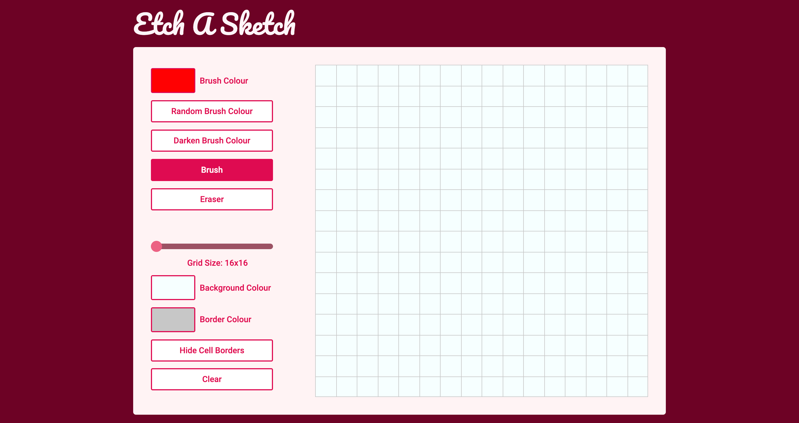

# Etch A Sketch

**Check out** the app [here](https://ibndaanis.github.io/etch-a-sketch/)

### Features of this app:

- You can paint the grid with a brush.
- The brush, background and border colours can be changed.
- Grid sizes can be changed from 16x16 to 96x96.
- The grid can be erased.
- You can hide the grid cell borders

## Preview:

